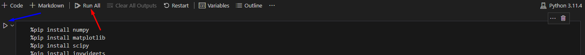
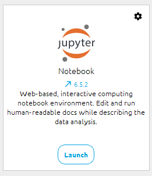
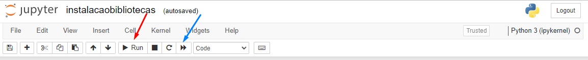
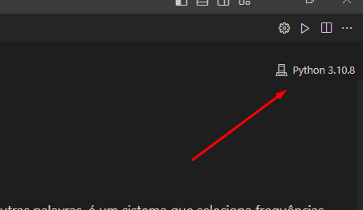
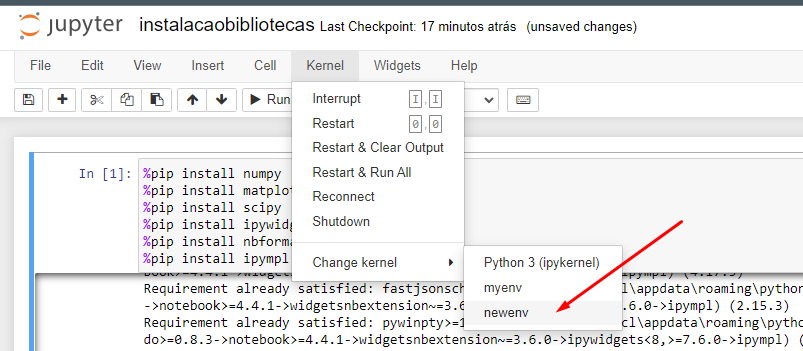

# Material de Estudos para Filtros com Jupyter Notebook

Bem vindo ao material de estudos para filtros. Neste material é possível aprender de forma prática sobre filtros, incluindo suas aplicações em equalizadores, delays e variações no tempo com filtros comb, wah, entre outros. É recomendado que após seguir as istruções de instalação abaixo o usuário comece sua jornada pelo notebook de introdução, rodando-o para garantir o funcionamento adequado dos outros notebooks.

### Índice

- [✔️ Tecnologias utilizadas](#%EF%B8%8F-tecnologias-utilizadas)
- [🔨  Instalação](#--instalação)
- [❌ Solução de Problemas (Troubleshooting)](#-solução-de-problemas-troubleshooting)

## ✔️ Tecnologias utilizadas
- <a href="http://jupyter.org/"></a>
- <a href="https://www.python.org/"></a>

## 🔨  Instalação
Para continuar, vamos garantir que um ambiente propício esteja funcionando em sua máquina.

Dois modos serão abordados por este material: um usa o [Visual Studio Code](https://code.visualstudio.com/) um editor de código-fonte desenvolvido pela Microsoft para Windows, Linux e macOS muito utilizado por todas as áreas, 
o outro involve o uso do [Anaconda](https://www.anaconda.com/download/) uma distribuição das linguagens de programação Python que visa simplificar o gerenciamento e a implantação de pacotes. O uso do Visual Studio Code permite uma visualização mais ampla dos widgets e é de mais fácil manutenção, mas o anaconda é de mais fácil instalação apesar de ser mais dificil sua manutenção, os dois modos são abordados nas seções abaixos:

- [Modo 1 - Visual Studio Code](#modo-1---visual-studio-code)
- [Modo 2 - Anaconda](#modo-2----anaconda)
 
## Modo 1 - Visual Studio Code
Para começar garanta que na sua máquina esteja instalado o Visual Studio Code (VSCode) e o Python 3:

- [Instalar Visual Studio Code](https://code.visualstudio.com/download)
- [Instalar Python 3](https://www.python.org/downloads/)

Após as instalações acima, abra a pasta do projeto dentro do VSCode a partir de `File/Arquivo > Open Folder/Abrir pasta` dentro do programa.

Instale as extensões necessárias para rodar o Notebook

- [Python](https://marketplace.visualstudio.com/items?itemName=ms-python.python)

</a>

 
 - [Jupyter](https://marketplace.visualstudio.com/items?itemName=ms-toolsai.jupyter)

</a>


Após a instalação correta, comece visitando o arquivo `\Notebooks\instalacaobibliotecas.ipynb` e rode o arquivo através do botão abaixo que roda todos as células de um notebook [seta vermelha]  ou do botão abaixo que roda apenas uma célular por vez [seta azul].

<p align="center">

</p>

**Obs importante:** Caso apareça qualquer prompt pedindo instalações adicionais tal qual o da figura abaixo, por favor permita a instalação dos mesmos clicando em `Install/Instalar` ou `Ok`

<p align="center">

</p>

Após a finalização das instalações das bibliotecas é possível ver um  que indica
que aquela célula foi rodada com sucesso e finalizada, juntamente com o tempo de execução. Após este passo-a-passo você pode começar a utilizar os notebooks.


## Modo 2 -  Anaconda
Para começar garanta que na sua máquina esteja instalado o Anaconda:

- [Anaconda ](https://www.anaconda.com/download/)

Após a instalação correta, abra o aplicativo: Anaconda Navigator

<p align="center">

</p>

Após a abertura do Anaconda Navigator, é possível ver vários aplicativos a serem usados. **ATENÇÃO!!** O Jupyter Lab pode não funcionar corretamente com este notebook, aqui vamos utilizar o Jupyter Notebook

<p align="center">

</p>

Procure pela pasta do projeto e comece visitando o arquivo `\Notebooks\instalacaobibliotecas.ipynb`. Rode o notebook através do botão abaixo que roda todos as células de um notebook [seta azul]  ou do botão abaixo que roda apenas uma célular por vez [seta vermelha].

<p align="center">

</p>

Espere a finalização da instalação das bibliotecas.

Após a finzalização da instalação já pode abrir e começar a desfrutar dos outros notebooks.

**Obs importante:** Alguns notebook demoram até 1 minuto para rodar pela primeira vez, e não há indicação visual desta primeira execução, ao rodar o notebook aguarde um pouco até a visualização do widget.

## ❌ Solução de Problemas (Troubleshooting)

Caso você já tenha o Python instalado em sua máquina e já tenha utilizado ele para outros projetos talvez, por conta de configurações feitas anteriormente, seu notebook não rode de maneira adequada ou os widgets não funcionem como o esperado. A ideia é sempre:

1. Apagar os outputs
2. Reiniciar o Kernel/Reiniciar o aplicativo utlizado
 
4. Rodar o notebook de novo

Se esses passos acima não resolverem o seu problema, recomenda-se criar um ambiente novo Python para usar para este projeto. 

No **Vscode**, clique na versão do Kernel:

<p align="center">

</p>

Vá em `Select nother Kernel` > `Python Environments` > `Create Python Environment` > `Venv` e espere a inicialização do novo ambiente. Após isso reproduzia os passos de instalações de bibliotecas e tente novamente usar seu notebook.

No  **Anaconda**, feche o Anaconda Navigator e abra o Anaconda Prompt, programa que também vem junto com a instalação geral do Anaconda. Nele rode:

```console
$ conda create --name newenv
```
Permita a continuação da instalação digitando y e apertando enter. Depis rode:

```console
$ conda activate newenv
$ conda install -c anaconda ipykernel
```
Também permitindo a continuação. Por fim rode:

```console
$ python -m ipykernel install --user --name=newenv
```

Após isto, abra novamente o Jupyter Notebook através do Anaconda Navigator e vá novamente no notebook  de instalação de biblitecas e selecione:

<p align="center">

</p>


Aguarde seu Kenerl inicializar e instale novamente as bibliotecas. Após isso pode usar os outros notebook normalmente sempre lembrando de alterar o Kernel em cada um deles e esperar o mesmo iniciar ANTES de rodar seu notebook.

